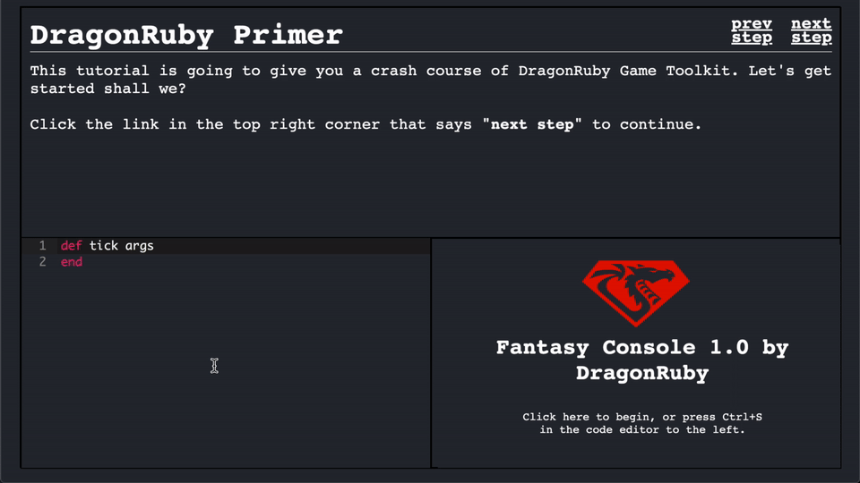

Serve up the static website with any simple http server.

Open index.html and add tutorial steps there using this template:

```html
   <script class="tutorial-step" type="text/html" data-tutorial-step="1">
     <p>Tutorial text goes here. Be sure to change the data-tutorial-step
     property with every new step.</p>
   </script>
```

Here's what it looks like:


